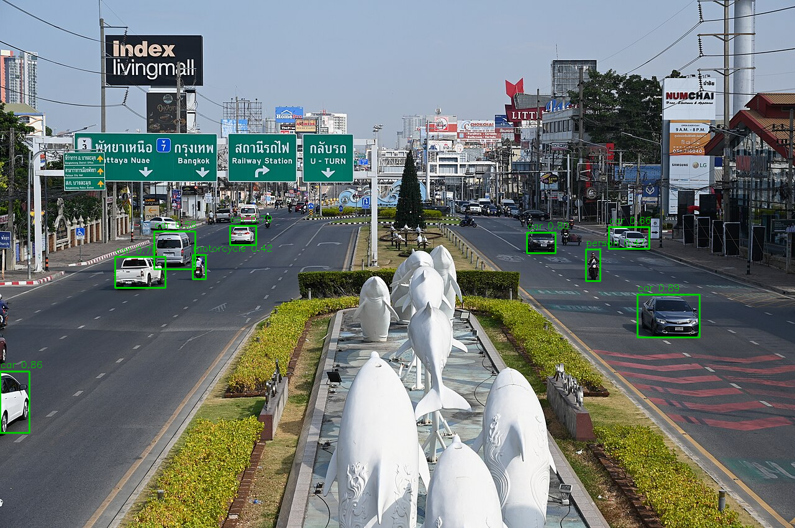

# Street Object Detection with YOLOv5

> A small script that runs a pretrained YOLOv5 model on a street photo, draws a
> box around every object it finds, and saves the labelled image.

This is my assignment for Introduction to Open Source Software. I took the
object detection skeleton from class, rewrote it to run locally instead of in
Colab, made a few changes of my own, and tested it on a busy street photo that
is different from the demo image used in class.

Built by **Prodipta Acharjee**.

---

## What it does

You point the script at an image. It then:

- Loads the `yolov5s` model with its pretrained COCO weights.
- Runs detection on the image.
- Draws a green box and a label around each detected object.
- Prints the total number of objects and each object name with its confidence.
- Saves the result as `output_result.png`.

---

## Tools and libraries used

- Python 3.13
- PyTorch and torchvision (run the model)
- YOLOv5 from Ultralytics (the detection model, loaded through PyTorch Hub)
- OpenCV (read the image, draw the boxes, save the output)
- NumPy (handle the detection array)

---

## How to run

Install the requirements first:

```bash
pip install -r requirements.txt
```

Then run the script from inside the project folder:

```bash
python main.py
```

The first run downloads the YOLOv5 weights automatically (about 14 MB), so it
needs an internet connection that one time. After that it works offline.

---

## Input image

The input is `input_image.jpg`, a photo of a city street with several cars on the
road, a few people, and a motorcycle. It is a real street scene from Wikimedia
Commons, not the image we used in class. I picked something busy on purpose so
the model would have more than one or two objects to find.

---

## Output result

The output is saved as `output_result.png`. It is the same street photo with a
green box and a label drawn over every object the model was confident about.

On my run the model detected 9 objects:

```
Total objects detected: 9
  car: 0.89
  car: 0.86
  car: 0.80
  car: 0.79
  car: 0.78
  car: 0.66
  car: 0.58
  person: 0.47
  motorcycle: 0.42
```

It found all the clear cars correctly and also picked up a person and a
motorcycle further down the road. Before filtering, the model also boxed a white
roadside statue and labelled it a surfboard, since it was trained on everyday
objects and has no class for statues. I added a small allowlist of street
objects so only traffic gets drawn, which removes that misread.

---

## Screenshot



---

## What I changed from the class skeleton

- Lowered the confidence threshold from 0.50 to 0.40 so more objects show up.
- Changed the bounding box color from red to green.
- Added a printout of the total object count and every detected object name.
- Added an allowlist of street objects so only traffic is drawn, which filters
  out odd misreads like the roadside statue.
- Rewrote the Colab upload and display code so the script reads the image from a
  file and saves the output directly, which lets it run on a normal computer.

---

## License

MIT. See [LICENSE](LICENSE).

---

## Author

Prodipta Acharjee. Introduction to Open Source Software, Sejong University, 2026.

Input photo "DSC 7564 - a city street filled with lots of traffic" from Wikimedia
Commons, licensed CC BY-SA 2.0.
